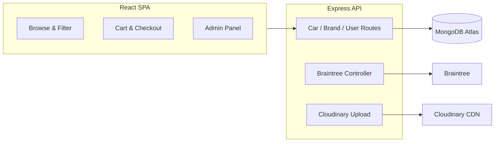

# CarWale — MERN Car Marketplace with Braintree, MongoDB & Cloudinary

> **Built by Baloch Dev Team**

[](https://www.balochdev.com)
[](https://react.dev)
[](https://www.mongodb.com)
[](https://expressjs.com)
[](LICENSE)

**Keywords:** car marketplace MERN, CarWale dealership, Braintree payments, Cloudinary car images, 360 car viewer, carwale-dealership-mern

**Repository:** `carwale-dealership-mern`

**Live demo:** [carwale.onrender.com](https://carwale.onrender.com)

---

Comprehensive **car buying platform** built on the MERN stack — browse, filter, and purchase vehicles with Braintree payments, Cloudinary media, 360° visualization, and a full admin panel.

---

## Features

- Braintree payment gateway integration (Drop-in UI)
- 360-degree car visualization and image gallery
- Advanced search and filtering by price, brand, and specs
- Brand-based browsing and related car recommendations
- JWT authentication with protected user routes
- Admin panel: cars, brands, orders, and user management
- Cloudinary image upload for inventory
- MongoDB Atlas cloud database

---

## Tech Stack

| Layer | Technology | Notes |
|-------|------------|-------|
| Frontend | React 18, CRA, Ant Design, React Router 6 | `client/` |
| Backend | Node.js, Express 4, Mongoose 7 | `server/` |
| Database | MongoDB Atlas | Cars, brands, users, orders |
| Payments | Braintree | Sandbox/production gateway |
| Media | Cloudinary, Multer | Car photo uploads |
| Auth | JWT, bcryptjs | User sessions |

---

## Quick Start

```bash
git clone https://github.com/BalochDevOrg/carwale-dealership-mern.git
cd carwale-dealership-mern

cd client && npm install && cd ..
cd server && npm install && cd ..
```

### Environment

```bash
cp client/.env.example client/.env
cp server/.env.example server/.env
```

### Run

```bash
# Terminal 1 — API (default :5000)
cd server && npm run dev

# Terminal 2 — React (default :3000)
cd client && npm start
```

Seed sample cars: `cd server && npm run seed:cars`

---

## Environment Variables

| File | Key variables |
|------|---------------|
| `server/.env.example` | `PORT`, `MONGO_URI`, `JWT_SECRET`, `CLOUDINARY_*`, `BRAINTREE_*` |
| `client/.env.example` | `REACT_APP_API_URL` |

> Use `.env.example` as a template only. Never commit live credentials.

---

## Use Cases

- Used / new car dealership websites
- Automotive marketplace MVPs
- MERN stack portfolio with payments and media
- Admin-managed vehicle inventory systems

---

## Architecture



---

## Deployment

- Frontend: [Render.com](https://render.com)
- Backend: [Render.com](https://render.com)
- Database: [MongoDB Atlas](https://www.mongodb.com/cloud)

---

## Contributing

Fork and PR. Conventional commits. No `.env` or API keys in commits.

---

## About BalochDev

| | |
|---|---|
| Website | [balochdev.com](https://www.balochdev.com) |
| Email | [team@balochdev.com](mailto:team@balochdev.com) |
| GitHub | [@BalochDevOrg](https://github.com/BalochDevOrg) |

---

## License

MIT © [BalochDev](https://www.balochdev.com) — see [LICENSE](LICENSE).
